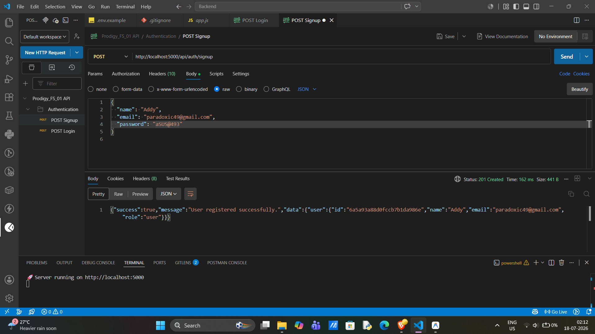
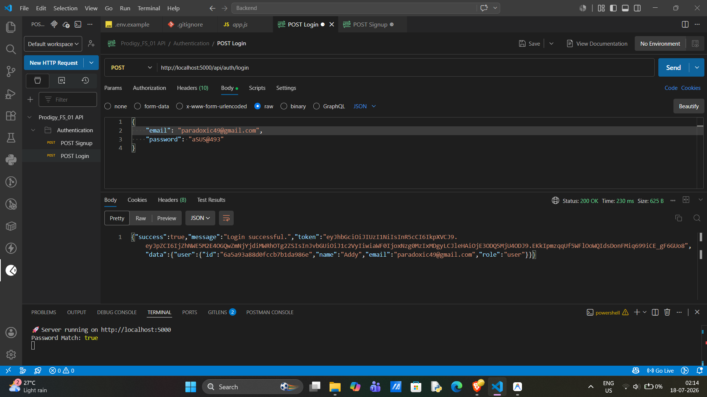
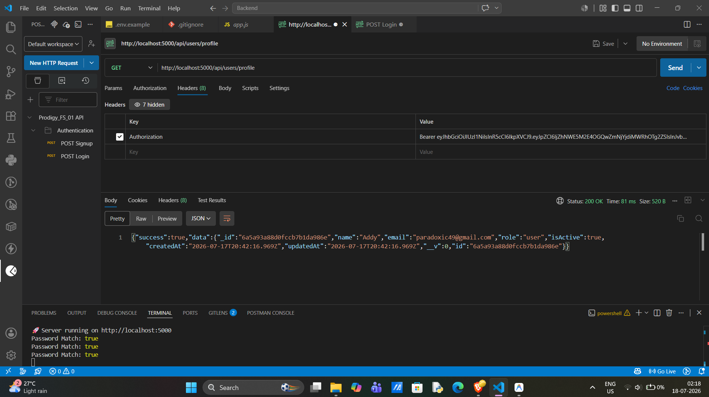

# 🚀 Prodigy_FS_01 — Secure JWT Authentication Backend


A production-oriented authentication backend built with **Node.js, Express.js, and MongoDB**, developed as part of the **Prodigy InfoTech Full Stack Web Development Internship** (Task 1).

This project demonstrates secure user authentication practices including password hashing, JWT-based authorization, protected routes, and environment-based configuration.

---

## 📑 Table of Contents

- [🚀 Prodigy\_FS\_01 — Secure JWT Authentication Backend](#-prodigy_fs_01--secure-jwt-authentication-backend)
  - [📑 Table of Contents](#-table-of-contents)
  - [✨ Features](#-features)
    - [🔐 Authentication](#-authentication)
    - [🛡️ Security](#️-security)
    - [⚙️ Backend Engineering](#️-backend-engineering)
  - [🏗️ Architecture](#️-architecture)
  - [📂 Project Structure](#-project-structure)
  - [🛠️ Tech Stack](#️-tech-stack)
  - [📌 API Documentation](#-api-documentation)
    - [1. User Signup](#1-user-signup)
    - [2. User Login](#2-user-login)
    - [3. Protected Route (Example)](#3-protected-route-example)
  - [⚙️ Installation \& Setup](#️-installation--setup)
  - [🔑 Environment Variables](#-environment-variables)
  - [📸 API Testing Screenshots](#-api-testing-screenshots)
    - [Signup API](#signup-api)
    - [Login API](#login-api)
    - [Protected Route](#protected-route)
  - [✅ Testing Checklist](#-testing-checklist)
  - [🔒 Security Highlights](#-security-highlights)
  - [🚀 Future Improvements](#-future-improvements)
  - [📄 License](#-license)
  - [👨‍💻 Author](#-author)

---

## ✨ Features

### 🔐 Authentication
- User registration (Signup)
- User login
- Secure password hashing using bcrypt
- JWT-based authentication
- Protected API routes
- Token-based authorization

### 🛡️ Security
- Passwords are never stored in plain text
- Environment variables for sensitive credentials
- Secure authentication middleware
- MongoDB Atlas secured connection
- Input validation and error handling

### ⚙️ Backend Engineering
- RESTful API architecture
- Modular folder structure
- Separation of routes, controllers, models, and configuration
- Scalable Express.js application design

---

## 🏗️ Architecture

```
Client
  |
  | REST API Requests
  ↓
Express.js Server
  |
  ├── Routes
  ├── Controllers
  ├── Authentication Middleware
  ├── Models
  ↓
MongoDB Atlas Database
```

---

## 📂 Project Structure

```
Prodigy_FS_01/
│
└── Backend/
    │
    ├── src/
    │   │
    │   ├── config/
    │   │   └── db.js
    │   │
    │   ├── controllers/
    │   │   └── authController.js
    │   │
    │   ├── middleware/
    │   │   └── authMiddleware.js
    │   │
    │   ├── models/
    │   │   └── user.js
    │   │
    │   ├── routes/
    │   │   ├── authRoutes.js
    │   │   └── userRoutes.js
    │   │
    │   ├── utils/
    │   │   └── generateToken.js
    │   │
    │   ├── app.js
    │   └── server.js
    │
    ├── screenshots/
    │   ├── signup.png
    │   ├── login.png
    │   └── protected-route.png
    │
    ├── .env.example
    ├── .gitignore
    ├── LICENSE
    ├── package.json
    ├── package-lock.json
    └── README.md
```

---

## 🛠️ Tech Stack

| Category | Technology |
|---|---|
| Backend | Node.js, Express.js |
| Database | MongoDB, MongoDB Atlas, Mongoose ODM |
| Authentication | JSON Web Tokens (JWT), bcrypt |
| Dev Tools | Git, GitHub, Postman, VS Code |

---

## 📌 API Documentation

### 1. User Signup

**Endpoint**
```
POST /api/auth/signup
```

**Request Body**
```json
{
  "name": "Adarsh",
  "email": "example@gmail.com",
  "password": "password123"
}
```

**Response — 201 Created**
```json
{
  "success": true,
  "message": "User registered successfully"
}
```

**Response — 400 Bad Request** (duplicate email or missing fields)
```json
{
  "success": false,
  "message": "User already exists"
}
```

---

### 2. User Login

**Endpoint**
```
POST /api/auth/login
```

**Request Body**
```json
{
  "email": "example@gmail.com",
  "password": "password123"
}
```

**Response — 200 OK**
```json
{
  "success": true,
  "token": "JWT_TOKEN"
}
```

**Response — 401 Unauthorized** (wrong credentials)
```json
{
  "success": false,
  "message": "Invalid email or password"
}
```

---

### 3. Protected Route (Example)

**Endpoint**
```
GET /api/users/profile
```

**Headers**
```
Authorization: Bearer <JWT_TOKEN>
```

**Response — 200 OK**
```json
{
  "success": true,
  "user": {
    "id": "64f...",
    "name": "Adarsh",
    "email": "example@gmail.com"
  }
}
```

**Response — 401 Unauthorized** (missing/invalid/expired token)
```json
{
  "success": false,
  "message": "Not authorized, no token"
}
```

---

## ⚙️ Installation & Setup

```bash
# Clone the repository
git clone https://github.com/aDARSH41Hub/Prodigy_FS_01.git

# Navigate to project
cd Prodigy_FS_01/Backend

# Install dependencies
npm install

# Create your .env file (see below)

# Run in development (with nodemon)
npm run dev

# Run in production
npm start
```

---

## 🔑 Environment Variables

Copy `.env.example` to `.env` and fill in your own values:

```
PORT=5000
MONGO_URI=your_mongodb_connection_string
JWT_SECRET=your_secret_key
```

> ⚠️ Never commit your actual `.env` file. It's already excluded via `.gitignore`.

---

## 📸 API Testing Screenshots

### Signup API



### Login API



### Protected Route



---

## ✅ Testing Checklist

Verified manually using Postman:

- [x] Signup with valid data → creates user, returns success
- [x] Signup with an email that already exists → returns error, does not create duplicate
- [x] Signup with missing fields (name/email/password) → returns validation error
- [x] Login with correct credentials → returns valid JWT
- [x] Login with incorrect password → returns 401, no token issued
- [x] Access protected route with valid token → returns user data
- [x] Access protected route with no token → returns 401
- [x] Access protected route with expired/invalid token → returns 401
- [x] Password stored in MongoDB is hashed, never plain text

---

## 🔒 Security Highlights

✅ bcrypt password encryption
✅ JWT authentication
✅ Protected API routes
✅ Environment variable protection (`.env` excluded from version control)
✅ Secure database credentials via MongoDB Atlas
✅ Modular backend architecture

---

## 🚀 Future Improvements

- Role-based access control (admin / user)
- Refresh token implementation
- Email verification
- Password reset functionality
- Rate limiting
- API documentation using Swagger
- Docker containerization
- Deployment using cloud services

---

## 📄 License

This project is licensed under the MIT License.
See the [LICENSE](LICENSE) file for details.

---

## 👨‍💻 Author

**Adarsh Pratap Singh**
Computer Science Engineering Student

GitHub: [@aDARSH41Hub](https://github.com/aDARSH41Hub)
LinkedIn: *https://www.linkedin.com/in/adarsh493/*

---

⭐ If you found this project useful, consider giving it a star.

*Built as part of the Prodigy InfoTech Full Stack Web Development Internship (Task 1 — Authentication System).*